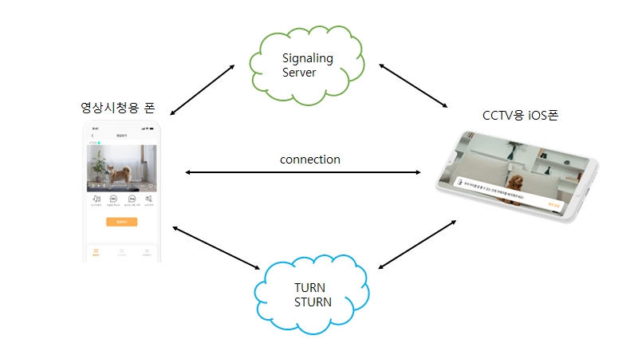
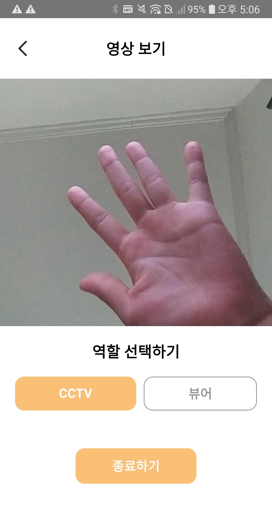

# WebRTC를 이용한 실시간 Pet CCTV

### 요약
> 최근 반려동물 양육가구 수 급증에 따라 반려동물 CCTV 서비스가 각광받고 있다. 대부분의 서비스가 WebRTC 기술을 활용하여 WebView에 구현되어 있지만, iOS에서는 여러 제약사항으로  WebView에서의 구현이 이전까지는 불가능한 상황이였다. iOS 14.3 부터 구현이 가능해짐에 따라, **WebRTC 기술을 활용하여 Server-Side Attack으로 부터 안전하고 Low Latency를 가진 실시간 Pet CCTV iOS 애플리케이션을 설계한다.**

<br/>

### 팀원
| [](https://github.com/wish0ne)| [](https://github.com/kimseo-0) | [](https://github.com/codeisneverodd-0) | 
| :-----------------------------------: | :---------------------------------------: |:---------------------------------------: |
| [장소원](https://github.com/wish0ne)|[김서영](https://github.com/kimseo-0)|[김경현](https://github.com/kimseo-0)|

---

## 연구배경

  최근 반려동물을 기르는 가구 수가 크게 증가하고 있다. 이러한 흐름에 맞춰 업무 시간동안 반려동물을 잘 돌볼 수 없는 맞벌이 가정이나 1인 가구 등을 위한, Pet CCTV의 수요가 늘어나고 있다. Pet CCTV는 반려인이 집에 없는 시간동안 반려동물의 상태를 살필 수 있는 서비스로, 국내 스타트업 펫페오톡은 스마트폰 공기계를 펫 CCTV로 활용하여, AI 행동 감지 녹화, 행동분석 리포트 제공받을 수 있는 도기보기 서비스를 출시하였다. 

  CCTV를 구현하기 위해서는 서로 다른 플랫폼의 디바이스간 실시간 영상 통신을 구현하여야 하는데, 이를 가능하게 하는 다양한 기술 중 WebRTC가 주목을 받고 있다. **WebRTC는 P2P 통신을 통해 높은 통신 품질과 HTTPS를 통한 높은 수준의 보안을 보장받고, 기존의 HTML5 및 WebSocket 기반의 인터페이스에 포함될 수 있다는 장점**을 가지고 있다. 도기보기 CCTV 서비스 또한 WebView기반의 앱에서 WebRTC 기술을 사용하여 구현이 되어있는데, iOS 14.3 이전 까지는 WebView에서 WebRTC를 지원하지 않아 이전까지는 CCTV를 위한 공기계로는 안드로이드 기기만 사용가능한 상황이었다. 
  
  iOS 모델을 CCTV로 활용할 수 있도록 요구하는 사용자들이 지속적으로 존재하던 중, iOS 14.3 버전부터 WKWebView에서 WebRTC 구현이 가능해짐에 따라 iOS에서의 구현이 가능해지게 되었다. 따라서 **WebRTC를 활용한 iOS 펫캠을 구현함으로써 더 많은 사용자층을 확보할 수 있도록 한다.**

<br/>

## 시스템 구성도


영상 시청용 폰에서 CCTV를 실행할 경우, TURN 및 STUN서버를 통하여 signaling을 주고받아 두 디바이스가 연결을 맺게 된다. 이후에는 P2P형태로 영상 및 음성 데이터를 직접 주고받는다.

<br/>

## 실행화면
> CCTV용 디바이스와 Viewer용 디바이스가 서로 연결되면 Viewer용 디바이스에서 실시간 영상을 시청할 수 있으며 마이크로 실시간 소통을 진행할 수 있다.

**로딩화면 - 메인화면(기기 추가 전) - cctv - viewer - 메인화면(cctv 작동중)** 순서입니다.

### 안드로이드
 

  


### iOS


<br/>

## 결론
본 연구에서는 WebRTC 기술을 이용하여 CCTV과 반려인의 디바이스를 P2P로 연결함으로써 서버 공격으로부터 오는 위험을 방지하고, WebView 기반으로 제작되어 확장성이 높은 실시간 Pet CCTV를 제안하였다. 이를 통해, 사용자들이 안심하고 쓸 수 있는 Pet CCTV를 개발 할 수 있을 것으로 기대된다.

<br/>

## 참조문헌
[1] Hunseop Jeong, and Young Ik Eom “Design and Implementation of an WebRTC-based Resource Sharing Framework” 

[2] 정보통신 기술용어 해설 “P2P” 

[3] MDN web docs “WebRTC” 

[4] webRTC officiar document 

[5] simicart “PWAvsReact Native:A Detailed Look” 

[6] hiddenbrains “React Native vs Flutter vs Progressive Web Apps (PWAs)”

---
## iOS 실행 방법
### 에뮬레이터 실행
```shell
npm run ios
```
## iOS 에러해결
### `pod install` 관련 문제 발생시 체크리스트
1. `.ruby-version`에 명시된 버전의 루비 설치

참고링크: [How to fix rbenv: version `x.x.x` is not installed](https://gist.github.com/esteedqueen/b605cdf78b0060299322033b6a60afc3)
```shell
rbenv install x.x.x
```
2. Homebrew update 실패시

참고링크: [Brew Update not working after mac 10.9](https://stackoverflow.com/a/20138806/17975809)
```shell
cd `brew --prefix`/Homebrew
git fetch origin
git reset --hard origin/master
```

### iOS 빌드 문제 발생시 체크리스트
1. 에뮬레이터를 찾지 못할 시

발생에러: `error: SDK "iphoneos" cannot be located`
참고링크: [error: unable to lookup item 'Path' in SDK 'iphoneos'](https://codechef.tistory.com/entry/react-native-%ED%94%84%EB%A1%9C%EC%A0%9D%ED%8A%B8-%EC%B4%88%EA%B8%B0-%EC%84%A4%EC%B9%98-%ED%9B%84-error-unable-to-lookup-item-Path-in-SDK-iphoneos-%EA%B0%84%EB%8B%A8-%ED%95%B4%EA%B2%B0-%EB%B0%A9%EB%B2%95)
```shell
sudo xcode-select --switch /Applications/Xcode.app
```

2. WebRTC 로딩 안됨.

발생에러: `Library not loaded: @rpath/WebRTC.framework/WebRTC`
참고링크: [Library not loaded: @rpath/WebRTC.framework/WebRTC](https://community.sendbird.com/t/library-not-loaded-rpath-webrtc-framework-webrtc/520)

gif-lfs 설치 후, pod 재설치
```shell
brew install git-lfs
pod deintegrate
pod install
```

### 기타 오류 해결
 - [Xcode 로딩 안됨 해결](https://velog.io/@dlwogus0128/swift-1.-Xcode-%EC%84%A4%EC%B9%98%ED%95%98%EA%B8%B0)
