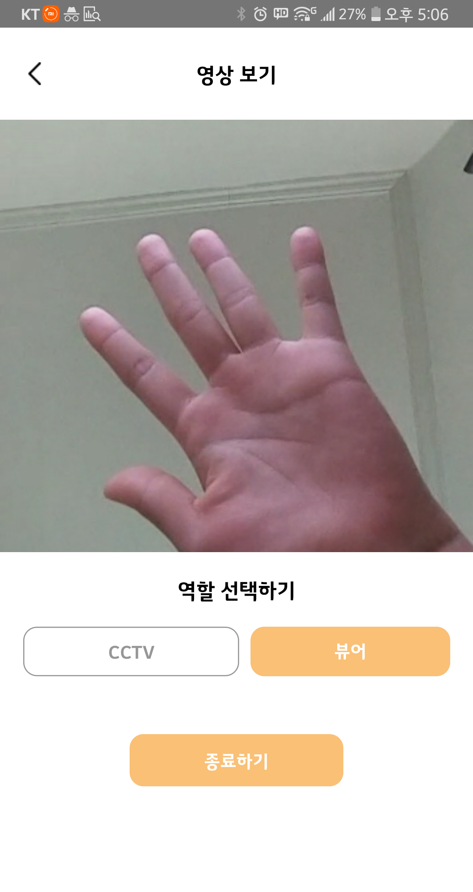

# WebRTC를 이용한 실시간 Pet CCTV

### 요약
> 최근 반려동물 양육가구 수 급증에 따라 반려동물 CCTV 서비스가 각광받고 있다. 대부분의 서비스가 WebRTC 기술을 활용하여 WebView에 구현되어 있지만, iOS에서는 여러 제약사항으로  WebView에서의 구현이 이전까지는 불가능한 상황이였다. iOS 14.3 부터 구현이 가능해짐에 따라, **WebRTC 기술을 활용하여 Server-Side Attack으로 부터 안전하고 Low Latency를 가진 실시간 Pet CCTV iOS 애플리케이션을 설계한다.**

 

### 팀원
| |  |  | 
| :-----------------------------------: | :---------------------------------------: |:---------------------------------------: |
| [장소원](https://github.com/wish0ne)|[김서영](https://github.com/kimseo-0)|[김경현](https://github.com/kimseo-0)|

---

## 연구배경

  최근 반려동물을 기르는 가구 수가 크게 증가하고 있다. 이러한 흐름에 맞춰 업무 시간동안 반려동물을 잘 돌볼 수 없는 맞벌이 가정이나 1인 가구 등을 위한, Pet CCTV의 수요가 늘어나고 있다. Pet CCTV는 반려인이 집에 없는 시간동안 반려동물의 상태를 살필 수 있는 서비스로, 국내 스타트업 펫페오톡은 스마트폰 공기계를 펫 CCTV로 활용하여, AI 행동 감지 녹화, 행동분석 리포트 제공받을 수 있는 도기보기 서비스를 출시하였다. 

  CCTV를 구현하기 위해서는 서로 다른 플랫폼의 디바이스간 실시간 영상 통신을 구현하여야 하는데, 이를 가능하게 하는 다양한 기술 중 WebRTC가 주목을 받고 있다. **WebRTC는 P2P 통신을 통해 높은 통신 품질과 HTTPS를 통한 높은 수준의 보안을 보장받고, 기존의 HTML5 및 WebSocket 기반의 인터페이스에 포함될 수 있다는 장점**을 가지고 있다. 도기보기 CCTV 서비스 또한 WebView기반의 앱에서 WebRTC 기술을 사용하여 구현이 되어있는데, iOS 14.3 이전 까지는 WebView에서 WebRTC를 지원하지 않아 이전까지는 CCTV를 위한 공기계로는 안드로이드 기기만 사용가능한 상황이었다. 
  
  iOS 모델을 CCTV로 활용할 수 있도록 요구하는 사용자들이 지속적으로 존재하던 중, iOS 14.3 버전부터 WKWebView에서 WebRTC 구현이 가능해짐에 따라 iOS에서의 구현이 가능해지게 되었다. 따라서 **WebRTC를 활용한 iOS 펫캠을 구현함으로써 더 많은 사용자층을 확보할 수 있도록 한다.**

 

## 관련 연구
### P2P 통신
P2P 통신은 클라이언트/서버 관계가 아닌 동등한 권한을 갖는 관계간의 통신의 의미한다. 중앙집중 관리용 서버 없이 즉시 네트워크 구축이 가능하다. 흔히 채팅, 음악/동영상 파일 공유, 온라인 게임 등에서 사용된다.
### Web RTC 
#### NAT(Network Address Translation)
P2P 통신, 임의의 두 브라우저가 직접 통신을 하기위해서는 public IP 주소를 알아내야한다. 하지만 일반적인 개인 컴퓨터에는 public IP 가 할당되어 있지 않다. NAT가 여러 대의 컴퓨터가 하나의 public IP를 공유하게 하고, 각 컴퓨터는 DHCP를 통해 유휴 상태의 IP를 일시적으로 임대 받아 사용하기 때문이다. 일반적으로 NAT 역할을 하는 라우터가 외부에서 접근하는 공인 IP와 port 번호를 확인하여 현재 네트워크 내의 사설 IP들을 매핑시켜주는 역할을 한다. 하지만 어떤 라우터들은 특정 주소나 포트와의 연결을 차단하는 방화벽이 설정되어 있을 수 있다. 이런 경우 라우터를 통과하여 연결할 방법을 찾는 과정(NAT traversal)이 필요하다

#### STUN(Session Traversal Utilities for NAT) server
STUN server에서 NAT traversal 작업이 이루어진다. STUN 방식은 클라이언트가 자신을 식별할 수 있는 유일한 public IP와 port 번호를 확인하는 프로토콜이다. 클라이언트는 STUN server에 자신의 public IP와 NAT 뒤에 있는 다른 클라이언트가 접근 가능한지에 대한 답변을 요청한다. 만약 NAT 역할을 하는 라우터에 엄격한 보안 정책(symmetric NAT)으로 인해 다른 클라이언트의 접근이 불가능한 경우, 대안이 필요하다.

#### TURN(Traversal Using Relays around NAT) server
TURN server를 통해 symmetric NAT 를 우회한다. TURN 방식은 네트워크 미디어를 중개하는 서버를 이용한다. 중간에 서버를 한 번 거치기 때문에 오버헤드가 발생한다. 하지만 보안 정책이 엄격한 개인 NAT 내부의 브라우저와 P2P 통신을 하기 위해서는 TURN 방식이 유일한 방법이기 때문에, 다른 대안이 없을 경우 최후의 수단으로 선택해야한다.

#### ICE(Interactive Connectivity Establishment) and candidate
candidate는 STUN, TURN 서버를 이용해 획득한 IP address, 프로토콜, port 조합으로 구성된 연결 가능한 네트워크 주소 후보이다.
ICE는 두 개의 단말이 P2P 연결을 가능하게 하도록 최적의 경로를 찾아주는 프레임워크이다. ICE 프레임워크는 STUN, 또는 TURN 서버를 이용해 상대방과 연결 가능한 candidate를 가지고 있다.

#### SDP(Session Description Protocol)
SDP는 WebRTC에서 스트리밍하기 위한 미디어의 해상도, 형식, 코덱 등의 초기 설정을 위해 채택한 프로토콜이다.

#### Signaling
Signaling은 WebRTC 연결 전 두 단말이 P2P 통신을 위한 제어 정보를 교환하는 과정이다.

### Architecture

## 시스템 구성도

영상 시청용 폰에서 CCTV를 실행할 경우, TURN 및 STUN서버를 통하여 signaling을 주고받아 두 디바이스가 연결을 맺게 된다. 이후에는 P2P형태로 영상 및 음성 데이터를 직접 주고받는다.

 

## 실행화면
> CCTV용 디바이스와 Viewer용 디바이스가 서로 연결되면 Viewer용 디바이스에서 실시간 영상을 시청할 수 있으며 마이크로 실시간 소통을 진행할 수 있다.

**로딩화면 - 메인화면(기기 추가 전) - cctv - viewer - 메인화면(cctv 작동중)** 순서입니다.

### 안드로이드
 

  

### iOS

 

## 결론
본 연구에서는 WebRTC 기술을 이용하여 CCTV과 반려인의 디바이스를 P2P로 연결함으로써 서버 공격으로부터 오는 위험을 방지하고, WebView 기반으로 제작되어 확장성이 높은 실시간 Pet CCTV를 제안하였다. 이를 통해, 사용자들이 안심하고 쓸 수 있는 Pet CCTV를 개발 할 수 있을 것으로 기대된다.

 

## 참조문헌
[1] Hunseop Jeong, and Young Ik Eom “Design and Implementation of an WebRTC-based Resource Sharing Framework” 

[2] 정보통신 기술용어 해설 “P2P” 

[3] MDN web docs “WebRTC” 

[4] webRTC officiar document 

[5] simicart “PWAvsReact Native:A Detailed Look” 

[6] hiddenbrains “React Native vs Flutter vs Progressive Web Apps (PWAs)”

